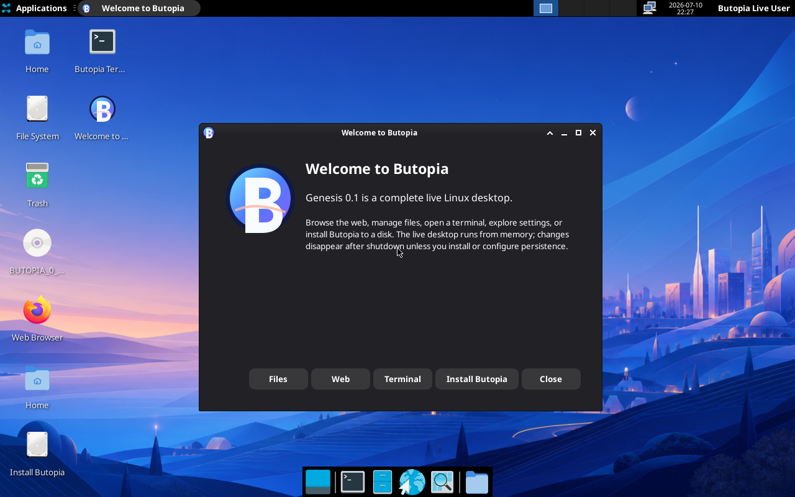

# Butopia Linux

Butopia is a graphical Linux distribution for x86_64 PCs. The
`0.1.0` release, **Genesis**, boots as a writable live system through legacy
BIOS or 64-bit UEFI, starts a branded Xfce desktop, manages software with
`apk`, auto-configures networking, and can install itself to disk with
`setup-butopia`.



Butopia owns its release identity, ISO profile, boot configuration, signed APK
repository, base package, installer entry point, and boot tests. It uses Alpine
Linux 3.24.1 as a compatibility foundation, which is stated explicitly as
`ID_LIKE=alpine` in `/etc/os-release`.

## Build and boot

On this macOS host, the build runs inside an isolated x86_64 Alpine VM. The VM
is intentionally the canonical local builder so package generation and ISO
assembly use Linux filesystem semantics.

```sh
brew install lima lima-additional-guestagents
make doctor
make builder
make iso
make smoke
```

The finished image is `dist/butopia-0.1.0-x86_64.iso`. Boot it interactively
with `make run` (BIOS) or `make run-uefi` (UEFI). The live GUI requires at
least 4 GiB RAM; the QEMU launchers allocate 4 GiB by default. Override that
with `BUTOPIA_QEMU_MEMORY_MB` when needed.

The normal boot automatically opens the graphical `butopia` live session.
Text consoles remain available for recovery; their live login is `root` with
no password. This is suitable for local live media and installation, but it
must not be exposed as a network login. SSH is installed for client/server
availability but is not enabled as a service.

Inside Butopia:

```sh
butopia info
butopia network
apk update
setup-butopia
```

`setup-butopia` delegates disk and account configuration to Alpine's proven
installer after checking that it is running as root on Butopia. Disk selection
is destructive; read each installer prompt carefully.

## What is included

- Alpine LTS kernel with broad PC hardware and firmware support
- Branded Xfce desktop with a generated Butopia wallpaper and welcome center
- Firefox ESR, Thunar, Mousepad, Ristretto, Xfce Terminal, and settings tools
- LightDM live-session autologin, NetworkManager, D-Bus, elogind, and eudev
- BusyBox/OpenRC base plus Bash, Nano, Less, Git, Curl, jq, htop, and tmux
- `apk` package management and a signed on-media Butopia package repository
- Butopia release, base, and installer APKs
- DHCP networking, OpenSSH tools, disk utilities, and hardware inspection tools
- Serial and VGA consoles for real hardware, QEMU, CI, and debugging
- Automated BIOS and UEFI boot/login assertions

Butopia 0.1 is intentionally focused: it is x86_64-only and ships one polished,
lightweight desktop rather than several competing desktop environments.

See [docs/ARCHITECTURE.md](docs/ARCHITECTURE.md) for the system design and
[docs/BUILDING.md](docs/BUILDING.md) for signing, reproducibility, and builder
details.

## Licensing

Butopia's original build/profile/package code is MIT licensed. The ISO combines
independently licensed upstream components; generated package metadata and the
upstream license texts remain authoritative for those components.
